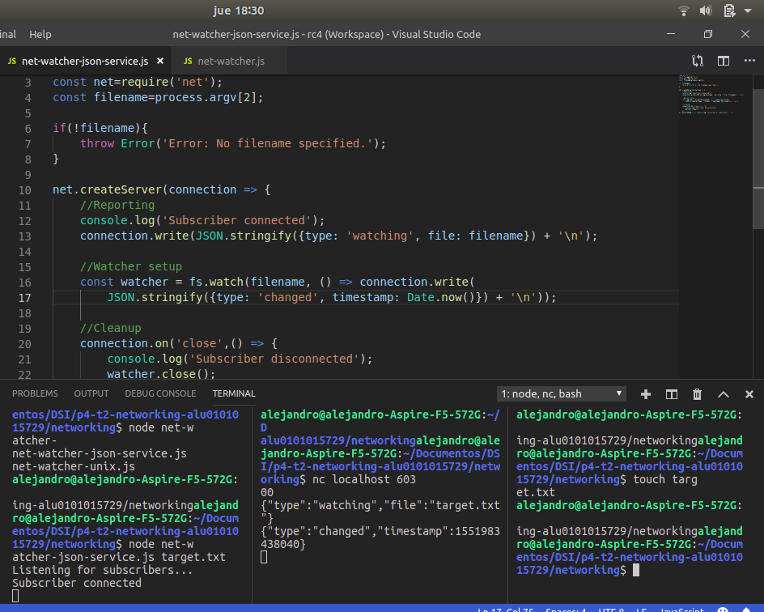

# p4-t2-networking-alu0101015729
# Binding A Server To A TCP Port 
Las conexiones de socket TCP constan de dos puntos finales. Un punto extremo se enlaza a un puerto numerado, mientras que el otro punto extremo se conecta a un puerto.
En Node.js, las operaciones de enlace y conexión son proporcionadas por el módulo net. El enlace a un puerto TCP para escuchar las conexiones se ve así:
```javascript
    'use strict';
    const net = require('net'),
    server = net.createServer(connection => {
      // Use the connection object for data transfer.
    });
    server.listen(60300);
```
El método net.createServer toma una función de devolución de llamada y devuelve un objeto Server.Node.js que invocará la función de devolución de llamada cuando otro punto extremo se conecte. El parámetro de conexión es un objeto Socket que se puede usar para enviar o recibir datos.
Al llamar a server.listen se une al puerto especificado. En este caso, estamos vinculando el número de puerto TCP 60300. Para tener una idea de la configuración, eche un vistazo a la figura. La figura muestra nuestro único proceso Node.js cuyo servidor vincula un puerto TCP. Cualquier número de clientes, que pueden o no ser procesos de Node.js: pueden conectarse a ese puerto vinculado.
 <br>
# Writing Data To A Socket
En la parte superior, introducimos los módulos principales de Node.js(fs y net). El nombre del archivo que se va a ver, si se proporciona, será el tercer argumento en process.argv. Si el usuario no proporcionó un archivo de destino para ver,lanzamos un error personalizado.
Ahora echemos un vistazo dentro de la función de devolución de llamada dada a createServer. Esta función de devolución de llamada hace tres cosas: Informa que la conexión se ha establecido (tanto para el cliente con connection.write como para la consola). Comienza a escuchar los cambios en el archivo de destino, guardando el objeto del observador devuelto. Esta devolución de llamada envía información de cambio al cliente usando connection.write. Escucha el evento de cierre de la conexión para informar que el suscriptor se ha desconectado y deja de ver el archivo, con watcher.close.Finalmente,observe que la devolución de llamada pasada a server.listen,al final, Node.js invoca esta función después de que haya enlazado correctamente el puerto 60300 y esté lista para comenzar a recibir conexiones.

# Connecting to a TCP Socket Server with Netcat
Para ejecutar y probar el programa net-watcher, necesitará tres sesiones de terminal: una para el servicio en sí, una para el cliente y otra para activar los cambios en el archivo visto.
En su primer terminal, use el comando watch para tocar el archivo de destino a intervalos de un segundo:        
```javascript
    $ watch -n 1 touch target.txt
```
Con eso funcionando, en un segundo terminal, ejecute el programa net-watcher:
```javascript
    $ node net-watcher.js target.txt 
```
Este programa crea un servicio de escucha en el puerto TCP 60300. Para conectarse a él, usaremos netcat, un programa de utilidad de socket. Abra un tercer terminal y use el comando nc de esta manera:
```javascript
$ nc localhost 60300
```
El resultado quedara algo como esto:
 <br>
El proceso de net-watcher une un puerto TCP y observa un archivo; ambos recursos se muestran como óvalos. Los suscriptores múltiples pueden conectarse y recibir actualizaciones simultáneamente. Si abre terminales adicionales y se conecta al puerto 60300 con nc, todos reciba actualizaciones cuando el archivo de destino cambie. Los sockets TCP son útiles para la comunicación entre computadoras conectadas en red. Pero si necesita procesos en la misma computadora para comunicarse, los sockets Unix ofrecen una alternativa más eficiente.
# Listening on Unix Sockets
Para ver cómo el net module usa sockets Unix, modifiquemos el programa net-watcher para usar este tipo de canal de comunicación. Tenga en cuenta que los sockets de Unix solo funcionan en entornos similares a Unix.
 <br>
# Implementing a Messaging Protocol
En esta sección diseñaremos e implementaremos un mejor protocolo. Un protocolo es un conjunto de reglas que define cómo se comunican los puntos finales en un sistema. Cada vez que desarrolle una aplicación en red en Node.js, estará trabajando con uno o más protocolos. Aquí crearemos un protocolo basado en pasar mensajes JSON a través de TCP. JSON prevalece increíblemente en Node.js. Lo usaremos ampliamente para la serialización y configuración de datos en todo el libro.
# Serializing Messages with JSON
 Vamos a desarrollar el protocolo de paso de mensajes que utiliza JSON para serializar los mensajes. Cada mensaje es un objeto serializado JSON, que es un hash de pares clave-valor. Aquí hay un ejemplo de objeto JSON con dos pares clave-valor:
 	
    {"key":"value","anotherKey":"anotherValue"}

El net-watcher service que hemos estado desarrollando en este capítulo envía dos tipos de mensajes que necesitamos convertir a JSON.
	Cuando se establece la conexión por primera vez, el cliente recibe la cadena: Now watching target.txt for changes... Codificaremos el primer tipo de mensaje de esta manera:
 	
    {"type":"watching","file":"target.txt"}

El campo de tipo indica que este es un mensaje de observación: el archivo especificado ahora se está viendo.

   Cuando el archivo de destino cambia, el cliente recibe una cadena como esta: File changed: Fri Dec 18 2015 05:44:00 GMT-0500 (EST). Codificado de esta manera:
   
 	{"type":"changed","timestamp":1358175733785}

Aquí el campo de tipo anuncia que el archivo de destino ha cambiado. El campo de marca de tiempo contiene un valor entero que representa el número de milisegundos desde la medianoche del 1 de enero de 1970. Esto resulta ser un formato de tiempo fácil para trabajar en JavaScript.
# Switching to JSON Messages
Ahora que hemos definido un protocolo mejorado y accesible por computadora, modifiquemos el servicio de net-watcher para usarlo. Luego, crearemos programas cliente que recibirán e interpretarán estos mensajes. Abra su editor en el programa net-watcher.js. Encuentra la siguiente línea:
    
    connection.write(`Now watching " ${filename} " for changes...\n );

Y reemplazarlo con esto:
	
    connection.write(JSON.stringify({type: 'watching', file: filename}) + '\n');

A continuación, busque la llamada a connection.write dentro del watcher:
 	
    const watcher =
 	  fs.watch(filename, () => connection.write(`File changed: ${new Date()}\n`));

Y reemplazarlo con esto:
 	
    const watcher = fs.watch(filename, () => connection.write(
 	    JSON.stringify({type: 'changed', timestamp: Date.now()}) + '\n'));

Guarde este archivo actualizado como net-watcher-json-service.js. Ejecute el nuevo programa como siempre, recordando especificar un archivo de destino:
 	
    $ node net-watcher-json-service.js target.txt
	Listening for subscribers...

Luego conecte usando netcat desde un segundo terminal:
 	
    $ nc localhost 60300
 	{"type":"watching","file":"target.txt"}

Cuando creas el archivo target.txt, verás una salida como esta en tu cliente:
 <br />

Ahora estamos listos para escribir un programa cliente que procesa estos mensajes.
# Creating Socket Client Connections
En este capítulo, hemos explorado el lado del servidor de los sockets Node.js. Aquí escribiremos un programa cliente en Node.js para recibir mensajes JSON de nuestro programa net-watcher-json-service. Comenzaremos con un implementación ingenua, y luego la mejora a través del resto del capítulo. Abra un editor, inserte esto y guárdelo como net-watcher-json-client.js:
```javascript
'use strict';
const net = require('net');
const client = net.connect({port: 60300}); 
client.on('data', data => {   
    const message = JSON.parse(data);
    if (message.type === 'watching'){     
        console.log(`Now watching: ${message.file}`);   
    } 
    else if (message.type === 'changed') {
        const date = new Date(message.timestamp);
        console.log(`File changed: ${date}`);
    }
    else {     
        console.log(`Unrecognized message type: ${message.type}`);   
    } 
});
```
Este programa corto utiliza net.connect para crear una conexión de cliente al puerto 60300 de localhost, luego espera los datos. El objeto cliente es un Socket, al igual que la conexión entrante que vimos en el lado del servidor.

Cada vez que ocurre un evento de datos, nuestra función de devolución de llamada toma el objeto de búfer entrante, analiza el mensaje JSON y luego registra un mensaje apropiado en la consola.

Para ejecutar el programa, primero asegúrese de que net-watcher-json-service se esté ejecutando. Luego, en otro terminal, ejecute el cliente:

    $ node net-watcher-json-client.js
 	Now watching: target.txt

Este programa funciona, pero está lejos de ser perfecto. Considere lo que sucede cuando finaliza la conexión o si no se puede conectar en primer lugar. Este programa solo escucha eventos de datos, no eventos finales o eventos de error. Podríamos escuchar estos eventos y tomar las medidas apropiadas cuando suceden.
# Testing Network Application Functionality
Las pruebas funcionales nos aseguran que nuestro código hace lo que esperamos que haga. En esta sección, desarrollaremos una prueba para nuestros programas de cliente y servidor de observación de archivos en red. Crearemos un servidor simulado que se ajuste a nuestro protocolo LDJ al tiempo que exponemos fallas en el cliente.
Después de que escribamos la prueba, arreglaremos el código del cliente para que pase.
# Understanding the Message-Boundary Problem
Cuando desarrollas programas en red en Node.js, a menudo se comunican pasando mensajes. En el mejor de los casos, un mensaje llegará a la vez. Pero a veces los mensajes llegarán en pedazos, divididos en distintos eventos de datos. Para desarrollar aplicaciones en red, deberá lidiar con estas divisiones cuando ocurran.
El protocolo LDJ que desarrollamos anteriormente separa los mensajes con caracteres de nueva línea. Cada carácter de nueva línea es el límite entre dos mensajes.
Nuestro programa de cliente actualmente se basa en que analiza cada mensaje enviando el contenido del búfer de datos directamente a JSON.parse.Pero considere lo que sucedería si un mensaje se dividiera por la mitad y llegara como dos eventos de datos separados. Tal división podría ocurrir en la naturaleza, especialmente para mensajes grandes. Creemos un servicio de prueba que envíe un mensaje dividido como este y descubramos cómo responde el cliente.
# Implementing a Test Service
Escribir aplicaciones robustas de Node.js significa manejar sin problemas problemas de red como entradas divididas, conexiones rotas y datos erróneos. Aquí implementaremos un servicio de prueba que divide un mensaje a propósito en múltiples partes y lo guardaremos en el archivo llamado test-json-service.js
Este servicio de prueba difiere de nuestro anterior net-watcher-json-service.js en algunos aspectos. En lugar de configurar un observador del sistema de archivos, como hicimos para el servicio real, aquí solo enviamos el primer fragmento predeterminado de inmediato.

Luego configuramos un temporizador para enviar el segundo fragmento después de un breve retraso. La función de JavaScript setTimeout toma dos parámetros: una función para invocar y una cantidad de tiempo en milisegundos. Después de la cantidad de tiempo especificada, la función será llamada.

Finalmente, cada vez que finaliza la conexión, usamos clearTimeout para cancelar la programación de la devolución de llamada. No es necesario programar la devolución de llamada porque una vez que se cierra la conexión, cualquier llamada a connection.write desencadenará eventos de error.

Finalmente, averigüemos qué sucede cuando nos conectamos con el programa cliente:
#captura
El error "SyntaxError: Unexpected token t" nos dice que el mensaje no fue completo y JSON válido. Nuestro cliente intentó enviar la mitad de un mensaje a JSON.parse, que solo espera cadenas JSON completas y con el formato correcto como entrada.

En este punto, hemos simulado con éxito el caso de un mensaje dividido proveniente del servidor. Ahora vamos a arreglar el cliente para trabajar con él.
# Extending Core Classes in Custom Modules
En este capítulo, crearemos un módulo que maneja la pieza de búfer de entrada para que el programa principal pueda recibir mensajes completos de manera confiable. A lo largo del camino, tendremos que hablar sobre los módulos personalizados y la extensión de las clases centrales en Node.

Extender EventEmitter
Para liberar al programa cliente del peligro de dividir los mensajes JSON, implementaremos un módulo de cliente de búfer LDJ. Luego lo incorporaremos al cliente de Network Watcher.

Inheritance in Node
Primero veamos cómo Node.js hace la herencia. El siguiente código configura LDJClient para heredar de EventEmitter.

	const EventEmitter = require('events').EventEmitter;
 	class LDJClient extends EventEmitter {
 	  constructor(stream) {
 	    super();
 	  }
 	}
LDJClient es una clase, lo que significa que otro código debe llamar a un nuevo LDJClient (secuencia) para obtener una instancia. El parámetro de flujo es un objeto que emite eventos de datos, como una conexión Socket.

Dentro de la función constructora, primero llamamos super para invocar la función constructora propia de EventEmitter. Siempre que estés implementando una clase que amplíe a otra clase, debes comenzar por llamar a super, con los argumentos de constructor apropiados para ello.

Es posible que le interese saber que bajo el capó, JavaScript utiliza la herencia prototípica para establecer la relación entre LDJClient y EventEmitter. La herencia prototípica es poderosa y se puede usar para más que solo clases, pero este uso es cada vez más raro.
# Buffering Data Events
Es hora de usar el parámetro de flujo en el LDJClient para recuperar y almacenar la entrada. El objetivo es tomar los datos en bruto entrantes de la secuencia y convertirlos en eventos de mensaje que contengan los objetos de mensaje analizados.

Echa un vistazo al siguiente constructor actualizado. Anexa fragmentos de datos entrantes a una cadena de búfer en ejecución y explora los finales de línea (que deben ser los límites de los mensajes JSON).
```javascript
	constructor(stream) {
 	  super();
 	  let buffer = '';
 	  stream.on('data', data => {
 	    buffer += data;
 	    let boundary = buffer.indexOf('\n');
 	    while (boundary !== -1) {
 	      const input = buffer.substring(0, boundary);
 	      buffer = buffer.substring(boundary + 1);
 	      this.emit('message', JSON.parse(input));
 	      boundary = buffer.indexOf('\n');
 	    }
 	  });
 	}
```
Comenzamos llamando a super, como antes, y luego configuramos una variable de cadena llamada buffer para capturar los datos entrantes. A continuación, usamos stream.on para manejar eventos de datos.

El código dentro del controlador de eventos de datos es denso, pero no es sofisticado. Agregamos datos sin procesar al final del búfer y luego buscamos los mensajes completos desde el frente. Cada cadena de mensaje se envía a través de JSON.parse y, finalmente, es emitida por el LDJClient como un evento de mensaje a través de this.emit.

En este punto, el problema con el que comenzamos (el manejo de mensajes divididos) se resuelve de manera efectiva. Ya sea que aparezcan diez mensajes en un solo evento de datos o solo la mitad de uno, todos precipitarán eventos de mensaje en la instancia de LDJClient.
# Exporting Functionality in a Module
Vamos a reunir los ejemplos de código anteriores y exponer LDJClient como un módulo. Comience creando un directorio llamado lib. Podría nombrarlo de otra manera, pero hay una convención fuerte en la comunidad Node.js para poner código de soporte en el directorio lib.
 <br>
Guarde el archivo como lib / ldj-client.js. El código para este módulo es la combinación de ejemplos anteriores más un método estático: la nueva sección module.exports al final.

Dentro de la definición de clase, después del constructor, estamos agregando un método estático llamado connect. Se adjunta un método estático a la propia clase LDJClient en lugar de aplicarse a instancias individuales. El método de conexión es simplemente una conveniencia para los consumidores de la biblioteca para que no tengan que usar el nuevo operador para crear una instancia de LDJClient.

En un módulo Node.js, el objeto module.exports es el puente entre el código del módulo y el mundo exterior. Todas las propiedades que establezca en las exportaciones estarán disponibles para el código ascendente que se extrae en el módulo. En nuestro caso, estamos exportando la propia clase LDJClient.
# Importing a Custom Node.js Module
Es hora de hacer uso de nuestro módulo personalizado. Modifiquemos el cliente para usarlo en lugar de leer directamente desde la secuencia TCP.
Abra un editor de texto e ingrese lo siguiente:
 <br>
Guarde este archivo como net-watcher-ldj-client.js. Es similar a nuestro net-watcher-json-client de Crear conexiones de cliente de socket. La principal diferencia es que, en lugar de enviar buffers de datos directamente a JSON.parse, este programa se basa en el módulo ldj-client para producir eventos de mensajes.

Para asegurarnos de que resuelve el problema del mensaje dividido, ejecutemos el servicio de prueba:
 <br>
# Developing Unit Tests with Mocha
Mocha es un popular marco de prueba multiparadigm para Node.js. Cuenta con varios estilos diferentes para describir sus pruebas. Usaremos el estilo de desarrollo dirigido por el comportamiento (BDD).
Para usar Mocha, primero lo instalaremos con npm, el administrador de paquetes integrado de Node.js. A continuación, desarrollaremos una prueba unitaria para la clase LDJClient. Y finalmente usaremos npm para ejecutar el conjunto de pruebas.
# Installing Mocha with npm
La instalación de paquetes Node.js con npm puede ser bastante fácil, lo que explica en parte la abundancia de módulos disponibles para usted. Aun así, es importante entender lo que está pasando para que pueda administrar sus dependencias.

npm se basa en un archivo de configuración llamado package.json, así que creamos uno ahora. Abra un terminal para su proyecto de red y ejecute esto:

	npm init -y
	npm install --save-dev --save-exact mocha@3.4.2
Puede ignorar de forma segura las advertencias en la salida por ahora. npm solo sugiere que agregue algunos campos descriptivos a su package.json.
Cuando el comando termine, habrá hecho algunos cambios. Ahora tendrás un directorio llamado node_modules en tu proyecto, que contiene Mocha y sus dependencias. Y si abres tu archivo package.json, deberías encontrar una sección devDependencies que se parece a esto:

	"devDependencies": {
    	"mocha": "3.4.2"
 	},
# Writing Mocha Unit Tests
Con Mocha instalado, ahora desarrollaremos una prueba unitaria que lo utiliza.
Cree un subdirectorio llamado prueba para contener su código relacionado con la prueba. Esta es la convención para los proyectos Node.js en general, y de manera predeterminada, Mocha buscará sus pruebas allí.
A continuación, cree un archivo en su directorio de prueba llamado ldj-client-test.js y agregue el siguiente código:
 <br>
Vayamos a través de este código. Primero, incorporamos los módulos que necesitamos, incluido el módulo de afirmación integrado de Node.js. Esto contiene funciones útiles para comparar valores.

A continuación, utilizamos el método de descripción de Mocha para crear un contexto con nombre para nuestras pruebas con LDJClient. El segundo argumento a describir es una función que contiene el contenido de la prueba.

Dentro de la prueba, primero declaramos dos variables con let: una para la instancia LDJClient, cliente, y otra para el EventEmitter subyacente, secuencia. Luego, en beforeEach, asignamos nuevas instancias a ambas variables.

Finalmente lo llamamos para probar un comportamiento específico de la clase. Dado que nuestra clase es asíncrona por naturaleza, invocamos la devolución de llamada realizada que Mocha proporciona para indicar cuando la prueba ha finalizado.

En el cuerpo de la prueba, configuramos un controlador de eventos de mensajes en el cliente. Este controlador utiliza el método deepEqual para afirmar que la carga útil que recibimos coincide con nuestras expectativas. Por fin le decimos a nuestro flujo sintético que emita un evento de datos. Esto hará que nuestro manejador de mensajes se invoque en unos pocos turnos del bucle de eventos.
# captura
# Travis
 <br>
